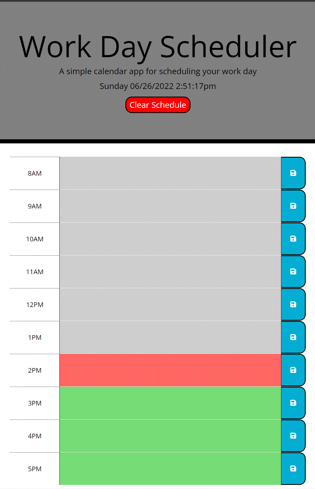

# Work Day Scheduler

Basic single work day calendar application

---

Created by: Robert Bishop

Comments, suggestions and constructive criticism always welcome.

---

## Contents:
* [Live Page Link](#live-page-link)
* [Demo](#demo)
* [Usage](#usage)
* [Skills/Concepts Used](#skillsconcepts-used)
* [Steps Taken](#steps-taken)
* [Thoughts/Future Ideas](#thoughtsfuture-ideas)
* [Links](#links)

---

## Live Page Link:

[https://rbishop85.github.io/work-day-scheduler/](https://rbishop85.github.io/work-day-scheduler/)

---

## Demo:

> Demo of scheduler in operation.

---

## Usage:

- Upon first loading the page you will be greated with a single day work schedule with separate blocks for each time slot in the work day and the current date and time displayed at top.
- Time blocks should all be color coded. Grey if that time slot has already passed, red if it's the current hour and green if it's an hour that's still in the future.
- You can freely key schedule items into any time slot.
- If you click the save icon to the right of a given schedule item, it'll save that item to local storage and you'll see a notification that this has occurred.
- If you reload the page, any saved items will still be displayed..
- Hitting the red "Clear Schedule" button at the top of the bay will initiate a popup confirming that you wish to clear all schedule items.  If you select OK then the local storage for the page will be deleted and the page will reload to show that it's now empty.

---

## Skills/Concepts Used:

* HTML for the basic layout of the page.
* CSS for some simple styling to keep it looking intereasting.
* Javascript to control the running of the app.
  - Variables & Arrays to store all the necessary values.
  - Functions to run set tasks.
  - Event Listeners to monitor button events and link to set functions.
  - If statments.
  - Interacting with the DOM to pull info from the webpage and insert content back into it.
  - Timeouts.
  - localStorage to save values for when page is reloaded
* Third Party APIs.
  - Bootstrap used for some basic page layout and classes.
  - jQuery to simplify some code.
  - Moments.js to handle date/time.
  - Font Awesome to provide the save icon.

---

## Steps Taken:

- [x] Created repo and copied in starter files.
- [x] Created and linked js file.
- [x] Created starting variables and worked on basic layout for time blocks.
- [x] Pulled save icon from awesome font, worked on alignment of items inside time blocks.
- [x] Setup appending of time blocks to container object, formatted block display times and setup check for the past present or future tense of time blocks.
- [x] Setup save buttons to save appropriate text box to local storage.
- [x] Worked with moments.js determine current hour as well as display current date/time.
- [x] Made some adjustments to save button to ensure the function worked whether you clicked on the icon or open button area.
- [x] Changed Date/time dispay at top of page to actually cycle through time like a normal clock.
- [x] Streamlined click event using jQuery
- [x] Spent some time editing styling and setup button to clear entire schedule.
- [x] Streamlined time block hour display to use a moments.js formatting of the selected time, rather than an if else statement.
- [x] Organized JS file and added detailed notes to js and css files.
- [x] Added a temporary status display to notify user when the app is saving their data to local storage.
- [x] Created README.

---

## Thoughts/Future Ideas:

This was a fun simpler project.  In the future I'd like spend more time customizing the styling.  I'd also like to add individual clear data buttons to each time block.  To make this app more usefull I'd also like to see it expanded beyond a simple one day app to actually work alongside a full length calendar that allows you to view/edit either the current day or past/future days.

---

## Links:

<a href="https://getbootstrap.com/" target="_blank">Bootstrap</a>

<a href="https://jquery.com/" target="_blank">jQuery</a>

<a href="https://momentjs.com/" target="_blank">Moments.js</a>

<a href="https://fontawesome.com/" target="_blank">Font Awesome</a>

---

[Top of Page](#work-day-scheduler)